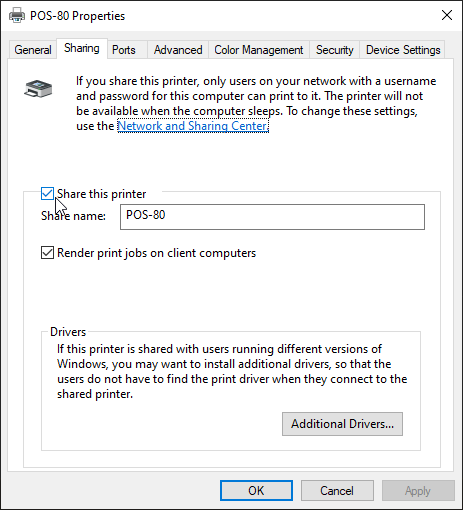

# ([<- Main](../README.md)) Printer setup

- [(\<- Main) Printer setup](#--main-printer-setup)
  - [Glossary](#glossary)
  - [Hardware](#hardware)
    - [Network (Ethernet/Wifi) printers](#network-ethernetwifi-printers)
    - [USB printers](#usb-printers)
  - [Software](#software)
    - [Network (Ethernet/Wifi) printer](#network-ethernetwifi-printer)
    - [USB printer](#usb-printer)

## Glossary

- Self test page: A page that is printed by the printer that contains information about the printer. This page is used to find the printer IP address and other information.
  - Is printed by turning off the printer and holding the feed button while turning it back on.

## Hardware

### Network (Ethernet/Wifi) printers

1. Connect the power cable to the printer.
2. Connect the printer to the router through wifi or ethernet cable.
3. Print a self test page to find the printer IP address.
4. If the printer IP adress is in the same subnet as the router (e.g. `192.168.1.x`) then the printer is connected to the network. If not we must connect to the printer through the printer's wifi/ethernet network and change the IP settings to match the router's.
5. Connect to the printer through the browser by typing the printer IP address in the address bar.
6. Change the IP address to a static IP address that is in the same subnet as the router.
7. Follow the steps in [software](#network-ethernetwifi-printer) to configure the printer to work with quickord.

---

### USB printers

1. Connect the power cable to the printer.
2. Connect the printer to the computer through a USB cable.
3. Install the printer driver.
4. Open `run.exe` by pressing `Win + R` or searching for `run` or `εκτέλεση`.
5. Type `shell:::{A8A91A66-3A7D-4424-8D24-04E180695C7A}` and hit enter.
   .png)
6. Right click on the printer and select `Printer properties`.
   .png)
7. Go to the `Sharing` tab and share the printer.
8. Give the printer a name (e.g. `POS-80`).
   
9. Follow the steps in [software](#usb-printer) to configure the printer to work with quickord.

---

## Software

### Network (Ethernet/Wifi) printer

Make sure the steps in [hardware](#network-ethernetwifi-printers) are completed before continuing.

1. Launch the server by running the `Quickord Printer Server` shortcut.
2. Open the dashboard by going to [this website](https://waiter.quickord.com/printer-server).
3. Find the printer IP address by printing a self test page.
4. Test the printer by clicking on the `test` button next to the correct IP address.
5. If the test prints something click on the `add` button to add the printer to the list of printers.
6. Configure the printer below.

If there are issues with the printer check the printer manual for further instructions

---

### USB printer

Make sure the steps in [hardware](#usb-printers) are completed before continuing.

1. Launch the server by running the `Quickord Printer Server` shortcut.
2. Open the dashboard by going to [this website](https://waiter.quickord.com/printer-server).
3. Connect the USB printer to the computer.
4. On the dashboard click on the `Add new printer manually` button.
5. On the new printer form fill in the `PORT` field with the following format: `\\localhost\printer-name`. (e.g. `\\localhost\QuickordPrinter`)
6. Click on the `test` button to test the printer.
7. Configure the rest of the printer settings.

If there are issues with the printer check the printer manual for further instructions. If the manual does not help, then you will need to troubleshoot windows printer sharing.
